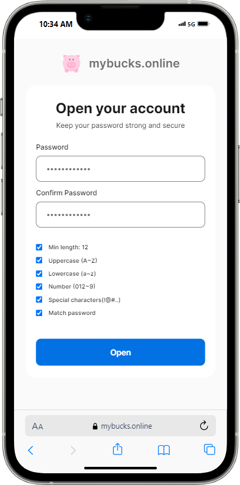
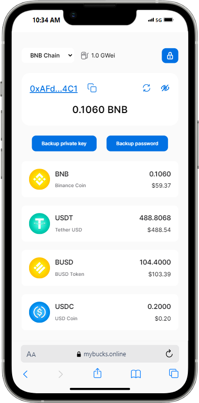
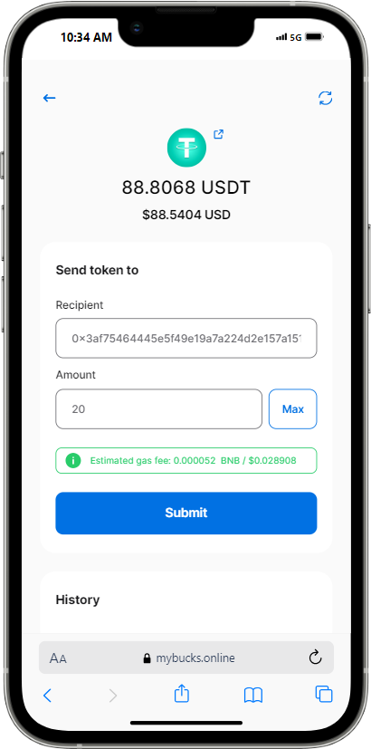

# mybucks.online

## Summary

This is a **password-only crypto wallet** built with [React.js](https://react.dev). It generates a private key from your password using an industry-standard, verified **one-way hash function**. Your private key forms your account, allowing you to transfer, receive, and hold your crypto assets permanently.

## How to Use

1. Visit `app.mybucks.online`
2. Input your password and confirmation
3. Click `Open`

(This process is the same for both initial opening and all subsequent uses.)


<p align="center">



</p>

## Key Points

### Privacy Protection

- **No Registration Required:** No need for personal information, not even your email address.
- **Absolute Privacy:** Nobody knows who you are; nobody stores your password.
- **Transient Data:** Your account is generated whenever you open it. Closing or refreshing your browser erases all traces/history.
- **Share your wallet address:** its origin remains unknown.

### Security

- **One-Way Hash Function:** Utilizes [**scrypt**](https://en.wikipedia.org/wiki/Scrypt) and [**keccak256**](https://en.wikipedia.org/wiki/SHA-3). Your password determines a unique private key.
- **Resistance to Attacks:** Brute force attacks would take centuries. A strong password ensures asset protection.

### Ease of Use

- **Simple Access:** Only requires a password, no 12-word seed phrases.
- **No KYC Hassles:** No worries about KYC or suspensions.
- **Private Key Portability:** Backup your password/private key. Import into Metamask to use across DeFi products.

### Analogy

Think of it like a public locker at a railway station:

1. Find an empty box.
2. Set up your password anonymously.
3. Place your goods inside and lock.

Return later to access your goods with just your password—no ID checks required.

That's all! 🎉

## Generate the private key

This demonstrates how to generate a private key from your password and helps you understand the process.

```javascript
import { Buffer } from "buffer";
import { ethers } from "ethers";
import { scrypt } from "scrypt-js";

const HASH_OPTIONS = {
  N: 32768, // CPU/memory cost parameter, 2^15
  r: 8, // block size parameter
  p: 5, // parallelization parameter
  keyLen: 64,
};

async function generatePrivateKey(rawPassword) {
  // separate even, odds characters from the rawPassword
  const password = rawPassword.split().filter((, index) => index % 2 === 0).join("")
  const salt = rawPassword.split().filter((, index) => index % 2 === 1).join("")

  const passwordBuffer = Buffer.from(password);
  const saltBuffer = Buffer.from(salt);

  const hashBuffer = await scrypt(
    passwordBuffer,
    saltBuffer,
    HASH_OPTIONS.N,
    HASH_OPTIONS.r,
    HASH_OPTIONS.p,
    HASH_OPTIONS.keyLen,
    (p) => console.log(Math.floor(p * 100))
  );
  const hashHex = Buffer.from(hashBuffer).toString("hex");
  const privateKey = ethers.keccak256(abi.encode(["string"], [hashHex]));

  return privateKey;
}
```

## Transfer Ownership

You can transfer all your holdings to family or friends in a few seconds by sharing your password only.

```
mybucks.online / mYpAssword987^5
```

Send this short note to your friend in a private channel.

# About the Project

This is a fully open-source project built with React, Vite, and related third-party libraries such as:

- **scrypt-js**  
  Implements the `scrypt` hash function. Please check the npm registry [here](https://www.npmjs.com/package/scrypt-js).

- **ethers**  
  A standard library for manipulating EVM accounts.

- **@covalenthq/client-sdk**  
  Provides query functions for massive crypto assets in multiple networks.

- **@sushiswap/default-token-list**

- **styled-components**

## How to Run

```bash
yarn install
cp .env.example .env
# Update the .env variables with valid keys
yarn dev
```

## Production Environment

The project uses `Github Pages` and `Github Actions` for deployment and is connected to a custom domain.
You can easily verify releases, deployments, and domain configuration:

- [Actions](https://github.com/koko37/mybucks.online-app/actions)
- [Releases](https://github.com/koko37/mybucks.online-app/releases)
- [.github/workflows/main-pipeline.yml](https://github.com/koko37/mybucks.online-app/blob/master/.github/workflows/main-pipeline.yml)

To check DNS settings:

```bash
nslookup
> app.mybucks.online
Server:		127.0.0.53
Address:	127.0.0.53#53

Non-authoritative answer:
app.mybucks.online	canonical name = koko37.github.io.
Name:	koko37.github.io
~~~~~~~~~~~~~~~~~~~~~~~~
```

```bash
dig app.mybucks.online

; <<>> DiG 9.18.28-0ubuntu0.22.04.1-Ubuntu <<>> app.mybucks.online
;; global options: +cmd
;; Got answer:
;; ->>HEADER<<- opcode: QUERY, status: NOERROR, id: 26113
;; flags: qr rd ra; QUERY: 1, ANSWER: 5, AUTHORITY: 5, ADDITIONAL: 11

;; OPT PSEUDOSECTION:
; EDNS: version: 0, flags:; udp: 65494
;; QUESTION SECTION:
;app.mybucks.online.		IN	A

;; ANSWER SECTION:
app.mybucks.online.	5	IN	CNAME	koko37.github.io.
~~~~~~~~~~~~~~~~~~~~~~~~
```